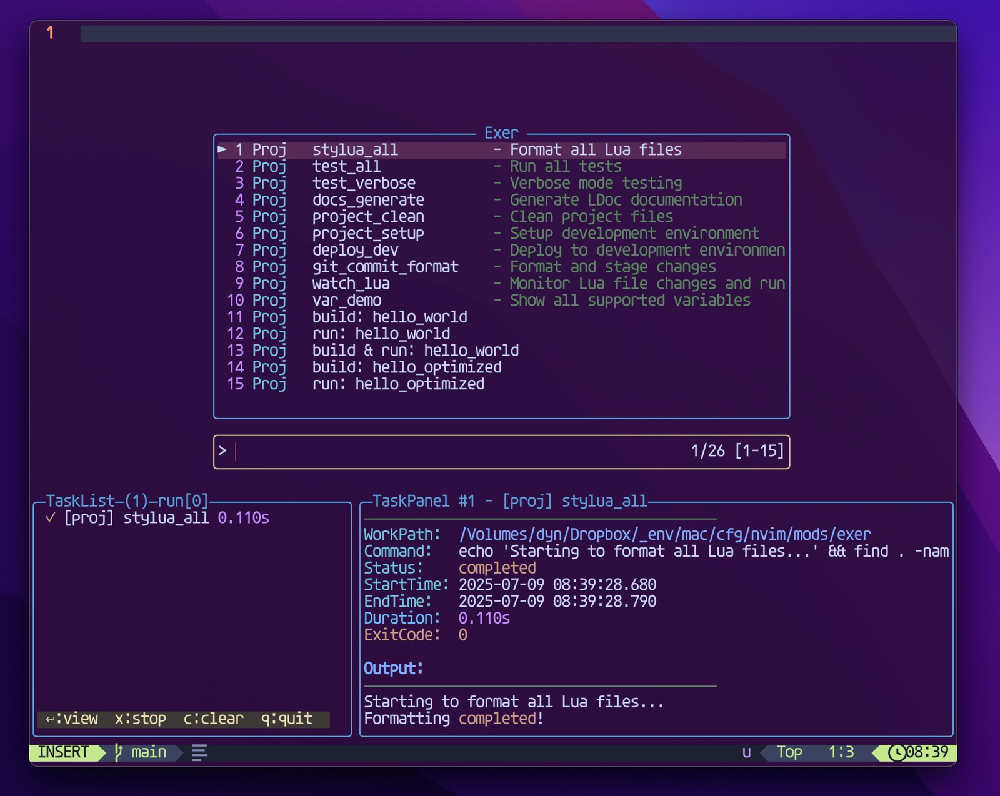

# exer.nvim

A unified multi-language task executor for Neovim.

<p align="center">
	<p align="center">
		
	</p>
</p>


## Features

- **Multi-language support** – Run code across multiple languages through a single interface  
- **Unified task management** – Consistent UI for compiling, executing, and testing  
- **Project-aware configuration** – Auto-detects and runs project-specific tasks  
- **Real-time output** – Live output with ANSI color support  
- **Smart navigation** – Smooth window switching between editor and task views  
- **Extensible architecture** – Easily integrate with build tools and test frameworks  


<p align="center">
	<p align="center">
		
	</p>
</p>

## Requirements

- **Neovim** >= 0.10.0
- A [Nerd Font](https://www.nerdfonts.com/) (for proper icon display)  


## Development Status

⚠️ **Work in Progress** – This plugin is under active development and subject to change.


## Installation

Install with your favorite package manager:

### [lazy.nvim](https://github.com/folke/lazy.nvim)

```lua
-- Option 1: Use default keymaps (automatic)
{
  "RazgrizHsu/exer.nvim",
  config = function()
    require("exer").setup()
  end,
}

-- Option 2: Custom keymaps via keys table
{
  "RazgrizHsu/exer.nvim",
  keys = {
    { "<leader>ro", "<cmd>ExerOpen<cr>", desc = "Open task picker" },
    { "<leader>rr", "<cmd>ExerRedo<cr>", desc = "Re-run last task" },
    { "<leader>rx", "<cmd>ExerStop<cr>", desc = "Stop all running tasks" },
    { "<A-/>", "<cmd>ExerShow<cr>", desc = "Toggle task output window" },
    { "<C-w>t", "<cmd>ExerFocusUI<cr>", desc = "Focus task UI" },
    { "<C-j>", "<cmd>ExerNavDown<cr>", desc = "Smart navigate down" },
    { "<C-k>", "<cmd>ExerNavUp<cr>", desc = "Smart navigate up" },
    { "<C-h>", "<cmd>ExerNavLeft<cr>", desc = "Smart navigate left" },
    { "<C-l>", "<cmd>ExerNavRight<cr>", desc = "Smart navigate right" },
  },
  config = function()
    require("exer").setup({
      debug = false,
      ui = {
        height = 0.4,
        list_width = 40,
        auto_toggle = false,
        auto_scroll = true,
        keymaps = {
          stop_task = 's',        -- Use 's' instead of 'x' to stop tasks
          clear_completed = 'd',   -- Use 'd' to clear completed tasks
          close_ui = '<Esc>',     -- Use Escape to close UI
          toggle_auto_scroll = 'a' -- Keep default 'a' for auto-scroll
        }
      },
    })
  end,
}

-- Option 3: Disable default keymaps completely
{
  "RazgrizHsu/exer.nvim",
  config = function()
    require("exer").setup({
      disable_default_keymaps = true,
      ui = {
        height = 30,          -- Fixed height: 30 lines
        list_width = 0.25,    -- List width: 25% of editor width
        auto_toggle = true,
        auto_scroll = false,
        keymaps = {
          stop_task = 's',        -- Use 's' instead of 'x' to stop tasks
          clear_completed = 'd',   -- Use 'd' to clear completed tasks
          close_ui = '<Esc>',     -- Use Escape to close UI
          toggle_auto_scroll = 'a' -- Keep default 'a' for auto-scroll
        }
      },
    })
    -- Set your own keymaps
    vim.keymap.set("n", "<leader>er", "<cmd>ExerOpen<cr>", { desc = "Open exer" })
  end,
}
```

## Quick Start

1. Open a source file in Neovim  
2. Press `<leader>ro` to open the task picker  
3. Select a task to execute  
4. View output in the task window  

## Key Bindings

| Key          | Command              | Description                          |
|--------------|----------------------|--------------------------------------|
| `<leader>ro` | `:ExerOpen`          | Open task picker                     |
| `<leader>rr` | `:ExerRedo`          | Re-run the last task                 |
| `<leader>rx` | `:ExerStop`          | Stop all running tasks               |
| `<A-/>`      | `:ExerShow`          | Toggle task output window            |
| `<C-w>t`     | `:ExerFocusUI`       | Focus on task output window          |
| `<C-hjkl>`   | —                    | Navigate between editor and task UI  |

## Configuration

### Plugin Setup Options

| Option | Type | Default | Description |
|--------|------|---------|-------------|
| `debug` | `boolean` | `false` | Enable debug logging |
| `disable_default_keymaps` | `boolean` | `false` | Disable all default keymaps |

### UI Configuration

| Option | Type | Default | Description |
|--------|------|---------|-------------|
| `ui.height` | `number` | `0.3` | UI height. Values 0.0-1.0 = percentage, >1 = fixed lines |
| `ui.list_width` | `number` | `36` | Task list width. Values 0.0-1.0 = percentage, >1 = fixed columns |
| `ui.auto_toggle` | `boolean` | `true` | Automatically open UI when a task starts |
| `ui.auto_scroll` | `boolean` | `true` | Automatically scroll task panel to show latest output |
| `ui.keymaps` | `table` | See below | Custom keymaps for UI interactions |

#### UI Keymaps

| Key | Default | Description |
|-----|---------|-------------|
| `stop_task` | `'x'` | Stop the selected/current task |
| `clear_completed` | `'c'` | Clear all completed tasks |
| `close_ui` | `'q'` | Close the task UI |
| `toggle_auto_scroll` | `'a'` | Toggle auto-scroll in task panel |


### Project Configuration (exec.toml)

exer.nvim supports project-specific task configuration through an `exec.toml` file in your project root.

#### Variable System

Use `${variable}` syntax in commands:

**File Variables**
- `${file}` - Full path of current buffer
- `${filename}` - Filename with extension (no path)
- `${name}` - Filename without extension
- `${fullname}` - Full path without extension
- `${ext}` - File extension
- `${filetype}` - Vim filetype value
- `${stem}` - Filename with extension

**Path Variables**
- `${dir}` - Directory of current file
- `${root}` - Project root directory
- `${cwd}` - Current working directory
- `${dirname}` - Current directory name

**System Variables**
- `${servername}` - Vim/Neovim server name

#### Basic Task Configuration

```toml
[exer]
# Single command tasks
acts = [
  { 
    id = "run", 
    cmd = "python ${file}", 
    desc = "Run Python file",
    when = "python"  # Only show for Python files
  },
  { 
    id = "compile", 
    cmd = "gcc ${name}.c -o ${name}", 
    desc = "Compile C file",
    when = "c",
    cwd = "build"    # Execute in build directory
  }
]

# Multi-step commands
[[exer.acts]]
id = "build_and_run"
cmd = [
  "gcc ${name}.c -o ${name}",
  "./${name}"
]
desc = "Build and run C program"
env = { DEBUG = "1", CC = "clang" }  # Environment variables
```

#### Application Configuration

```toml
# Define applications with build and run configurations
[[apps]]
name = "hello_world"
entry = "src/main.c"
output = "dist/hello"
type = "binary"          # binary, class, jar, script
files = ["src/*.c", "src/*.h"]
build_args = ["-Wall", "-O2"]
run_args = ["--verbose"]
```

#### Configuration Options

**Task Options (acts)**
- `id` - Unique task identifier (required)
- `cmd` - Command string or array (required)
- `desc` - Task description 
- `when` - Filetype condition
- `cwd` - Working directory
- `env` - Environment variables

**Application Options (apps)**
- `name` - Application name (required)
- `entry` - Entry file path (required)
- `output` - Output file path (required)
- `type` - Application type: binary, class, jar, script
- `files` - Related files (glob patterns)
- `build_args` - Compiler arguments
- `run_args` - Runtime arguments

#### Complete Example

```toml
[exer]
# Language-specific tasks
acts = [
  # Python
  { id = "run_py", cmd = "python ${file}", desc = "Run Python", when = "python" },
  { id = "test_py", cmd = "pytest ${file} -v", desc = "Test Python", when = "python" },
  
  # JavaScript/TypeScript
  { id = "run_js", cmd = "node ${file}", desc = "Run JS", when = "javascript" },
  { id = "run_ts", cmd = "tsx ${file}", desc = "Run TS", when = "typescript" },
  
  # C/C++
  { id = "compile_c", cmd = "gcc ${file} -o ${name}", desc = "Compile C", when = "c" },
  { id = "compile_cpp", cmd = "g++ ${file} -o ${name}", desc = "Compile C++", when = "cpp" },
  
  # Go
  { id = "run_go", cmd = "go run ${file}", desc = "Run Go", when = "go" },
  { id = "test_go", cmd = "go test ./...", desc = "Test Go", when = "go" }
]

# Project-wide tasks (always available)
[[exer.acts]]
id = "clean"
cmd = "rm -rf build dist"
desc = "Clean build artifacts"

[[exer.acts]]
id = "test_all"
cmd = ["npm test", "go test ./...", "pytest"]
desc = "Run all tests"

# Application definitions
[[apps]]
name = "my_server"
entry = "cmd/server/main.go"
output = "bin/server"
type = "binary"
build_args = ["-ldflags", "-s -w"]
run_args = ["--port", "8080"]

[[apps]]
name = "my_cli"
entry = "cmd/cli/main.go"
output = "bin/cli"
type = "binary"
```

## Developer Notes

> As a long-time JetBrains user transitioning to Neovim, I found no task executor that matched my workflow.  
> Inspired by the amazing plugins from the community, I decided to build one myself — and thus, *exer.nvim* was born.  
> This project is still evolving, and there's much room for improvement.  
> If it ends up helping even just one person, I'd consider it a success.

## Contributing

Contributions are welcome!  
Feel free to open an issue or submit a pull request.
